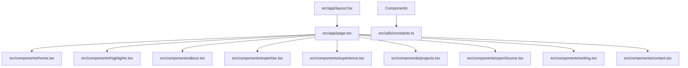

# Modernized Portfolio System

A premium, engineering-focused professional portfolio optimized for Staff Frontend Engineer, Frontend Architect, and Performance Engineer roles. 

Designed and engineered to benchmark against the aesthetic and architectural standards of Vercel, Stripe, Linear, and OpenAI.

---

## 🛠️ Technology Stack & Performance Highlights

* **Framework:** Next.js 14.2 (App Router, Static Pre-rendering)
* **Core:** React 18, TypeScript (Strict static analysis check)
* **Styling:** Tailwind CSS + custom CSS custom properties (Zinc theme)
* **Hydration & Build:** Code splitting, lazy-loaded components, and high-performance sub-sections
* **SEO & Observability:** Custom JSON-LD ProfilePage schema, static metadata optimization, and OpenGraph/Twitter configurations

---

## 🏗️ Architectural Overview & Design Patterns

The codebase is engineered with strict modular abstraction to demonstrate senior engineering maturity:



### Core Architecture Pillars:
1. **Performance Telemetry Dashboard:** Highlights crucial core metrics (e.g. INP reduction, critical path CSS gains, load time optimizations).
2. **Dynamic Adapter Protocols:** Adapts legacy React structures to current Next.js paradigms cleanly without overhead.
3. **Structured Project Representation:** Breaks down projects into *Problem*, *Solution*, and *Engineering Challenges* rather than simple bullet points, reflecting a product-minded engineering approach.
4. **Theme Customization Layer:** Maps Tailwind configurations dynamically to custom properties in `globals.css`, keeping colors consistent with modern dark zinc interfaces.

---

## 📂 Folder Structure

```text
├── public/                 # Static assets (Resume, PDF overlays, etc.)
└── src/
    ├── app/                # Next.js App Router (Layout, pages, and metadata)
    ├── assets/             # Raw icons, logo SVGs, local fonts, and image files
    ├── components/         # Reusable React components
    │   └── atoms/          # Atomic components (Headings, Timeline cards, Modals)
    ├── types/              # Common TypeScript definition interfaces
    ├── utils/              # Configuration constants, structured logs
    └── globals.css         # Custom property configurations, global utility classes
```

---

## 🚀 Getting Started

### Prerequisites

* Node.js (version 18 or above recommended)
* npm or Yarn

### Installation

1. Clone the repository:
   ```bash
   git clone https://github.com/aditya-n-suman/portfolio-next.git
   cd portfolio-next
   ```

2. Install dependencies:
   ```bash
   npm install
   ```

3. Run the development server locally:
   ```bash
   npm run dev
   ```
   Open [http://localhost:4000](http://localhost:4000) to view the application.

4. Build for production:
   ```bash
   npm run build
   ```

5. Run linter checks:
   ```bash
   npm run lint
   ```
